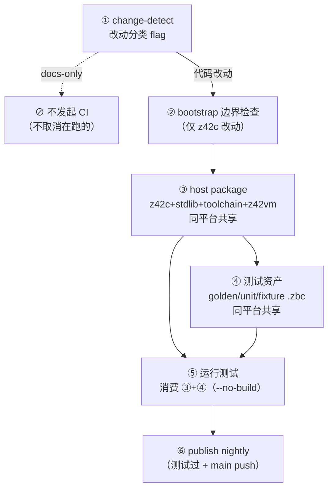

# CI 工作流

z42 CI 在 GitHub Actions 运行（[`.github/workflows/`](../../.github/workflows/)）。工具链 **100% z42 自举**：`z42c` 用 z42 写、编译为 zpkg；`z42vm` 是 Rust。

CI 与本地测试遵循**同一个 6 阶段分层流水线**——本地按阶段跑 `xtask` 即镜像 CI。深入的自举机制（SDK/Current 两套 toolchain、成对分代、不动点）见 [`testing/bootstrap.md`](testing/bootstrap.md)；本文聚焦 **CI 拓扑 + 阶段总览**。

> 🚧 **现状**：6 阶段模型是**目标拓扑**，迁移进行中（见 `docs/spec/changes/compile-once-toolchain/`）。阶段 3/4 已产出共享 artifact（`current-sdk`），阶段 5 的部分消费者（`test-consume`）已消费；其余测试 job 仍各自自举，逐步迁移。下文标注「✅ 已落地 / 🟡 进行中 / ⬜ 目标」。

---

## 6 阶段流水线



**核心思想**：平台无关的东西（zpkg、`.zbc`）**编一次、同平台共享**；只有原生件（z42vm per-arch）各平台各建。测试阶段**消费**前面编好的产物（`--no-build`），不重复编译/自举。

---

## 阶段详解

### ① change-detect
**做什么**：按改动路径分类，gate 后续阶段，避免无关改动的全量 churn。

| 规则 | 行为 | 状态 |
|------|------|------|
| (a) 非代码改动（`docs/**` / `**/*.md` / `.claude/**`）| **不触发 CI**（`on.paths-ignore`）→ 不发起、不取消在跑的 CI；`ci.yml` + `bench-update.yml` 都覆盖 | ✅ |
| (b) 未改 z42c（`src/compiler/**`）| 跳过阶段 ② 自举边界检查（`verify-selfhost` job `if: compiler`）| ✅ |
| (c) 未改 VM（`src/runtime/**`）| 跳过 Rust VM 单测（`build-and-test` Windows leg 的 `cargo test` step `if: vm`）| ✅ |
| (现有) 未改平台相关 | 跳过 wasm/ios/android/desktop 平台测试 | ✅ |

- **CI job**：`detect-changes`（`dorny/paths-filter`，输出 `platform`/`compiler`/`vm` flag；下游 job `needs: changes` + `if:` gate）。`.github/workflows/ci.yml` 进每个 filter → CI 自身改动**保底全跑**。
- **本地**：不适用（CI 专属；本地直接跑你要的 `xtask` 阶段）。

### ② bootstrap 边界检查
**做什么**：验证「**上一版已发布 nightly 的 z42c 能编译当前 z42c 源**」——守住 support-before-use 纪律（新语法/格式分两 release 引入），确保跨版本自举不断链。

- **触发**：仅 z42c（`src/compiler`）改动（rule b）。
- **CI job**：`verify-selfhost-linux-x64`（下载上一 nightly 种子 → 重建 z42c+stdlib+xtask → 不动点 gen1==gen2 逐字节）。
- **本地**：`xtask bootstrap-check`（⬜ 目标；现为 `scripts/check-bootstrap-compat.sh`）。
- 规范：[`.claude/rules/bootstrap-seed.md`](../../.claude/rules/bootstrap-seed.md)。

### ③ host package（同平台共享）
**做什么**：把当前源码编成一套工具链 `{z42c, stdlib, toolchain}`（zpkg，平台无关）+ `z42vm`（原生，per-arch），上传供下游消费。

- **产物**：`current-sdk-<os>` artifact（`.z42` 布局：`programs/z42c/` + `libs/` + `bin/z42vm`）。
- **共享性**：**zpkg 全平台共享**（编一次）；**z42vm 同平台共享**（每 host OS 一份，上传后同平台下游直接用，不重 `cargo build`）。
- **CI job**：`compile (linux-x64 / macos-arm64)`（原 `toolchain-bootstrap`）。
- **本地**：`xtask build sdk [--out artifacts/.z42]`（✅ 已落地）。
- 边界：z42c+stdlib 是「成对分代」产物（gen2），发布的就是它；详见 [`testing/bootstrap.md`](testing/bootstrap.md)。

### ④ 测试资产（同平台共享）
**做什么**：把测试用的 `.zbc` **编一次**——golden（`xtask regen`）、stdlib `[Test]` 单元、fixture——`.zbc` 平台无关，全平台共享，避免每个测试 job 重复 regen。

- **产物**：golden/unit/fixture `.zbc`（随 `current-sdk` artifact 或独立 `test-assets` artifact）。
- **CI**：`compile` job 内 `regen` 一次 + bundle 进 `current-sdk`（✅ golden 已落地 P2.4；unit/fixture ⬜）。
- **本地**：`xtask build test-assets`（⬜ 目标；现为 `xtask regen`）。

### ⑤ 运行测试（消费 ③+④）
**做什么**：下载 host package + 测试资产，**`--no-build` 消费**跑测试——不再自举、不再 regen。

- **CI job**（目标拓扑）：
  - `test (<平台>)`（原 `build-and-test`，4 OS）：vm goldens(interp) + cross-zpkg + stdlib + compiler。
  - `test-vm-jit-linux-x64`（4 shard）：VM goldens jit。
  - `test-stdlib-jit-linux-x64`（4 shard）：stdlib `[Test]` jit。
  - `test-consume-linux-x64`：消费 `current-sdk` 跑 cross-zpkg + vm interp（✅ 已落地，跨 job 消费验证）。
  - `test-compiler-stdlib-linux-x64`、`verify-features-linux-x64`、`test-{wasm,ios,android,desktop}`。
- **本地**：`xtask test [--toolchain <sdk>] [--no-build]`（✅ cross-zpkg/vm 已通；编排器 ⬜）。
- 约束（先简化后修）：① `test-runner` 是 native，暂保留——`xtask test` 接口不变，内部后续换 `z42.build`；② release-vm-jit 有 bug（见 [memory](../../.claude/projects)），jit 跑 debug vm 或延后。

### ⑥ publish nightly
**做什么**：测试通过 → main push → 发布 nightly（下一轮自举的种子）。

- **CI job**：`publish-nightly`（`needs: build-and-test + host-package + package-*`）。
- **防死锁**：**故意不** gate 在 download-bootstrap job（`test-vm-jit` / `test-stdlib-jit` / `verify-selfhost`）上——它们在 zbc/zpkg 格式 bump 那轮会暂时失败（要等兼容 nightly），gate 上去会死锁、无逃生口。「行为正确」由 `build-and-test`（在 needs 里）保证。

---

## CI job → 阶段映射

| 阶段 | CI job（新名）| 矩阵 |
|------|--------------|------|
| ① | `detect-changes` | — |
| ② | `verify-selfhost-linux-x64` | linux |
| ③ | `compile (<平台>)` | linux-x64, macos-arm64 |
| ④ | （并入 `compile`：regen + bundle）| linux |
| ⑤ | `test (<平台>)` / `test-vm-jit` / `test-stdlib-jit` / `test-consume` / `test-compiler-stdlib` / `verify-features` / `test-{wasm,ios,android,desktop}` / `package (<平台>)` / `package-{ios,android,wasm}` | 见各 job |
| ⑥ | `publish-nightly` | linux |

> job 命名约定：**动作-平台-(host)**，如 `test (linux-x64)` / `package-ios-macos`。

---

## GREEN 标准

任何 commit / PR merge 前必须全绿（[`.claude/rules/workflow.md`](../../.claude/rules/workflow.md) 阶段 8）。统一入口：

```bash
./xtask test          # 默认串联全 stage（完整 GREEN gate）
```

等价于（任一失败立刻停）：

```bash
cargo build --manifest-path src/runtime/Cargo.toml --release   # z42vm（Rust）无编译错误
./xtask test vm            # VM goldens（interp；jit 由 test-vm-jit 专腿覆盖）
./xtask test cross-zpkg    # 跨 zpkg 端到端
./xtask test lib           # stdlib [Test]（全量）
./xtask test compiler  # z42c 自举（build 7 子包 + 不动点 + [Test] units）
```

> 编译器正确性由 `test compiler`（z42c 自举不动点）保证。
> 任何测试失败（含 pre-existing）都不得 commit / push。

---

## 本地镜像 CI（按阶段跑）

6 阶段模型的价值：本地可以**按阶段跑、缓存昂贵的前段**，不必每次 `xtask test` 都重头编：

```bash
xtask build sdk          # 阶段③：编一次 host package → artifacts/.z42（缓存）
xtask build test-assets  # 阶段④：编一次测试资产（⬜ 目标命令）
xtask test --no-build    # 阶段⑤：消费③+④，反复迭代测试时不重编
```

> 目标：`xtask test`（无参）= 编排器，检测③④产物在否，缺则补、在则默认 `--no-build` 消费。

---

## 多平台 CI matrix

`test (<平台>)` 在 4-OS matrix 跑：`linux-x64`（ubuntu-latest）/ `linux-arm64`（ubuntu-24.04-arm）/ `macos-arm64`（macos-15）/ `windows-x64`（windows-latest）。平台支持矩阵设计见 [`docs/design/runtime/cross-platform.md`](../design/runtime/cross-platform.md)。

## Release 自动化

git tag → 跨平台 binary 自动产出。详见 [`release.md`](release.md)。nightly 由 `publish-nightly`（阶段⑥）滚动发布。
